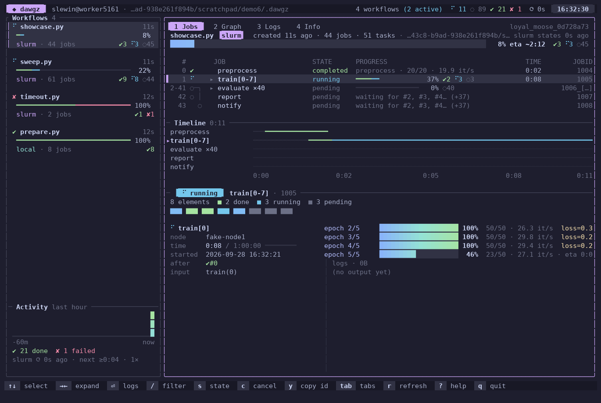
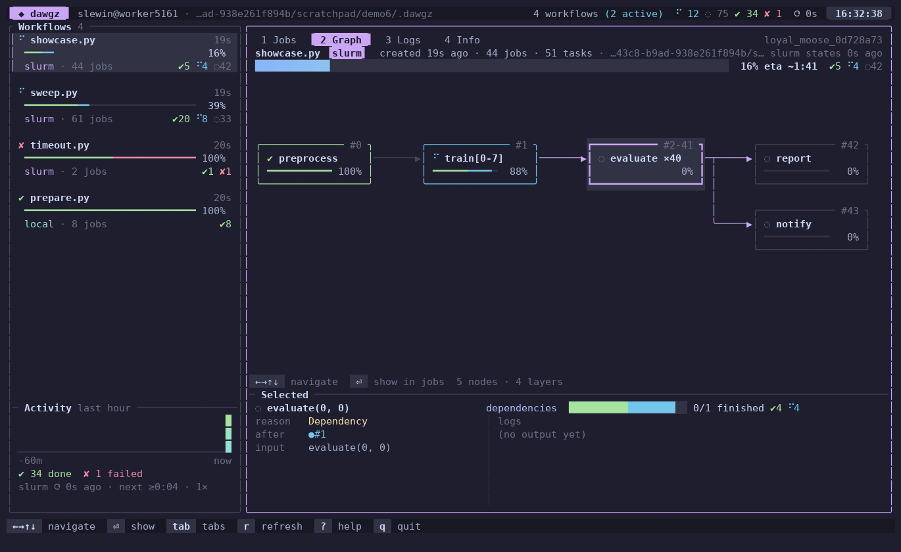

# Directed Acyclic Workflow Graph Scheduling

`dawgz` provides a lightweight and intuitive Python interface to declare, schedule and execute job workflows. It can also delegate execution to resource management backends such as [Slurm](https://wikipedia.org/wiki/Slurm_Workload_Manager), which means you can write, configure, and submit your workflows without ever leaving Python. Then, follow them from the command line or from an interactive terminal interface, with live progress bars, dependency graphs and logs.



## Installation

The `dawgz` package is available on [PyPi](https://pypi.org/project/dawgz/) and can be installed with `pip` (or `uv pip`).

```
pip install dawgz
```

Alternatively, if you need the latest features, you can install it from source.

```
pip install git+https://github.com/francois-rozet/dawgz
```

The interactive terminal interface `dawgz-tui` is a standalone binary written in Rust. Build it with [cargo](https://rustup.rs) from a clone of the repository, and `dawgz tui` will find it.

```
cargo install --path tui
```

## Getting started

In `dawgz`, a job is a Python function. The `dawgz.job` decorator allows to declare the resources a job requires and capture its arguments. A job's dependencies within the workflow are declared with the `dawgz.Job.after` method (or the `>>` operator). After declaration, the `dawgz.schedule` function takes care of scheduling the jobs and their dependencies, with a selected execution backend. For more information, check out the [interface](#interface) and the [examples](examples/).

Follows a small example demonstrating how one could use `dawgz` to calculate `π` (very roughly) using the [Monte Carlo method](https://en.wikipedia.org/wiki/Monte_Carlo_method). We define two jobs, `generate` and `estimate`. Five instances of `generate` are declared, and the `estimate` job has all of them as dependencies, meaning that it will only start after they have completed successfully.

```python
import dawgz
import glob
import numpy as np

@dawgz.job(cpus=1, ram="2GB", time="5:00")
def generate(i: int):
    print(f"Task {i + 1}")

    x = np.random.random(10000)
    y = np.random.random(10000)
    within_circle = x**2 + y**2 <= 1

    np.save(f"pi_{i}.npy", within_circle)

@dawgz.job(cpus=2, ram="4GB", time="15:00")
def estimate():
    files = glob.glob("pi_*.npy")
    stack = np.vstack([np.load(f) for f in files])
    pi_estimate = stack.mean() * 4

    print(f"π ≈ {pi_estimate}")

if __name__ == "__main__":
    generate_jobs = generate.map(range(5))
    estimate_job = estimate().after(*generate_jobs)

    dawgz.schedule(estimate_job)
```

By default, jobs are executed on the current machine, one at a time, in the order in which they are listed by `dawgz`: dependencies first, then creation order.

```
$ python examples/pi.py
▶ [1/6] generate(0)
Task 1
✔ generate · 0:00
...
▶ [6/6] estimate()
π ≈ 3.14936
✔ estimate · 0:00
✔ pi.py (brave_otter_3f2a9c1d) ran 6 jobs · inspect with dawgz 0
```

On a Slurm cluster, the same script submits the jobs to the queue with `backend="slurm"`, or without touching the code with the `DAWGZ_BACKEND` environment variable.

```
$ DAWGZ_BACKEND=slurm python examples/pi.py
✔ pi.py (crowded_machine_23bdd047) submitted 6 jobs · inspect with dawgz 1
```

## Following workflows

### Command line

The `dawgz` command lists workflows, shows the jobs of a workflow with a dependency graph and live progress, and the details and logs of a job. Similar jobs (e.g. `generate.map(range(50))`) are grouped into a single row with a stacked progress bar.

```
$ dawgz
#  WORKFLOW     ID                        CREATED  BACKEND  PROGRESS                        JOBS
0  prepare.py   crimson_narwhal_64d7bcfa  13s ago  local    ━━━━━━━━━━━━━━━━━━━━ ✔8            8
1  timeout.py   nimble_thistle_f92f542b   12s ago  slurm    ━━━━━━━━━━━━━━━━━━━━ ✔1 ✘1         2
2  sweep.py     hardy_mango_6ff7cb7b      12s ago  slurm    ━━━━╸─────────────── ✔9 ●8 ◌44    61
3  showcase.py  cobalt_moose_fc44171d     12s ago  slurm    ━╸────────────────── ✔5 ●4 ◌42    44
slurm states from 0s ago
$ dawgz 3
showcase.py  cobalt_moose_fc44171d  slurm · 22s ago · 44 jobs (51 tasks) · slurm states from 9s ago
━━━━━━━━━━━─────────────────────────────────────  24%  ✔12 ●7 ◌32

   #        JOB           STATE        PROGRESS                     TIME  JOBID
   0  ✔     preprocess    ✔ completed                               0:02  1004
   1  ✔     train[0-7]    ✔ completed  ━━━━━━━━━━ ✔8                0:09  1005
2-41  ●─╮   evaluate ×40  ● running    ╸───────── ✔3 ●7 ◌30         0:01  1006_[0-39]
  42  ◌ │   report        ◌ pending    waiting for #3, #6, #7, #8…        1007
  43    ◌   notify        ◌ pending    waiting for #3, #6, #7, #8…        1008
$ dawgz 3 train 2
#1 train[2]  ✔ completed
  job id    1005_2
  node      node-x
  time      0:08 / 1:00:00
  started   2026-09-28 16:27:19
  after     ✔ #0 preprocess

  epoch 1/5    ━━━━━━━━━━━━━━━━━━━━━━━━━━━━━━ 100% 50/50 · 27.4 it/s  loss=0.5051
  ...
  epoch 5/5    ━━━━━━━━━━━━━━━━━━━━━━━━━━━━━━ 100% 50/50 · 28.5 it/s  loss=0.1672

── logs · 1.2K · .dawgz/cobalt_moose_fc44171d/0001_train_2.log ─────────────────────
...
```

Workflows can be referred to by index (negative indices count from the end), by name or by (a prefix of their) ID, and jobs by index or by name.

| Command | |
|---|---|
| `dawgz` | list the recent workflows (`--all` for all) |
| `dawgz <wf>` | show the jobs of a workflow (`--expand` to ungroup similar jobs) |
| `dawgz <wf> <job> [<i>]` | show a job or array element, with its progress and the tail of its logs |
| `dawgz <wf> <job> --source`, `--input`, `--settings` | show the source, the input or the submission script of a job |
| `dawgz <wf> <job> --raw` | print the full logs (or source, ...) only |
| `dawgz logs <wf> <job> [<i>] [-f]` | print the logs of a job, or follow them as they grow |
| `dawgz cancel <wf> [<job> [<i>]]` | cancel a workflow, a job or an element (also `-c`) |
| `dawgz du` | show the disk usage of workflows |
| `dawgz clean` | delete old workflows or shrink their logs (see below) |
| `dawgz tui` | launch the interactive terminal interface |

Commands accept `--json` for machine-readable output, `--refresh` to query Slurm even if the cached states are recent and `--offline` to never query Slurm. `dawgz` and `dawgz <wf>` accept `-w/--watch` to refresh the view periodically.

### Terminal interface

`dawgz tui` (or `dawgz-tui`) opens an interactive dashboard of your workflows: workflow cards with live progress, a jobs table with a dependency graph and expandable fan-outs and arrays, array heatmaps, per-job progress bars, a timeline, a graph view, logs with follow mode, submission scripts and sources, fuzzy search (`/`), filters (`a` active only, `s` state), cancellation (`c`) and more (`?`). Without workflows in the current directory, it shows those of all the directories where you ran `dawgz` (`D` toggles).

`Q` opens the Slurm queue of all your jobs, dawgz or not, where jobs of dawgz workflows are shown by workflow and job name. The queue is fetched with a single `squeue -u $USER` when opened, and then at most once per minute while it is open.



### Progress

Jobs can report their progress, which `dawgz` and `dawgz-tui` display as live progress bars. Progress is written to a small status file (at most once per second), not to the logs.

```python
@dawgz.job(gpus=1, time="1:00:00")
def train(epochs: int):
    dawgz.status("loading data")
    ...
    for epoch in dawgz.progress(range(epochs), desc="epochs"):
        with dawgz.Progress(total=len(loader), desc="batches") as bar:
            for batch in loader:
                loss = step(batch)
                bar.update(1, loss=loss)
```

`tqdm` progress bars are also recognized automatically in the output of jobs, without any change to your code. Outside of `dawgz` jobs, `dawgz.progress` draws a simple bar on interactive terminals.

### Monitoring without overloading Slurm

`dawgz` records workflows in lightweight JSON files ([format](docs/format.md)): jobs report when they start, their progress and when they end. Monitors therefore know most states without querying Slurm, and only ask about jobs whose state cannot be known from files (e.g. jobs killed because of their time limit) with a **single** batched `sacct` call for all workflows, at most once every 20 seconds for the CLI and 30 seconds for the TUI (`DAWGZ_SACCT_TTL`). The results are cached and shared by all monitors (CLI and TUI). Jobs waiting for their dependencies are known to be pending, and jobs whose dependencies failed are known to be cancelled, without any query.

## Backends

* `local` (default) executes jobs on the current machine, each in a fresh process. With `workers=1` (default), jobs run one at a time, in the order listed by `dawgz`. This is what you want for resource-limited research workflows, e.g. several trainings sharing one GPU. Use `workers=4` to run up to 4 jobs in parallel, or `workers=None` to use all cores. With `start="spawn"`, each job runs in a fresh interpreter instead of a fork of the script. The standard streams of jobs are shown in the terminal and written to their logs.
* `slurm` submits jobs to the Slurm workload manager by generating `sbatch` submission scripts. Independent jobs are submitted concurrently (`concurrency=16`). Independent jobs with identical settings and dependencies (e.g. a fan-out) are *packed* into a single job array, with one task per job, which makes submission much faster and lighter for the Slurm controller while keeping per-job logs, states and dependencies (disable with `pack=False`). Use `throttle=4` to run at most 4 tasks of each pack or array at a time. Jobs whose dependencies can never be satisfied are cancelled by Slurm instead of pending forever.

    Functions of the main script are captured when jobs are created, but the modules they import are imported by the jobs when they start, possibly hours later. To keep editing your code meanwhile, use `snapshot=True` (or `DAWGZ_SNAPSHOT=1`): the local code imported by the script (modules and packages which are not installed in the environment, including editable installs, and the modules next to the script) is copied at submission, and jobs import this copy instead. Installed packages and data files are not copied.
* `dummy` is equivalent to `local`, but instead of executing the jobs, prints their name before and after a short (random) sleep time. The main use of `dummy` is debugging.
* `async` is an alias of `local`, kept for backward compatibility.

Options of other backends are ignored, such that you can switch backends with `DAWGZ_BACKEND` only.

## Logs and disk usage

Log files are kept small: redrawn lines (e.g. `tqdm` bars refreshing 10 times per second, including nested bars) are collapsed as they are written, and saved at most every 10 seconds (`DAWGZ_LOG_INTERVAL`) instead of accumulating megabytes of redraws. Set `DAWGZ_RAW_LOGS=1` in the environment of a job to disable this.

To free disk space, `dawgz du` shows the size of workflows (logs and pickles) and `dawgz clean` deletes or shrinks them. Workflows with pending or running jobs are skipped unless `--force` is given.

```
dawgz clean --older-than 7d               # delete workflows older than a week
dawgz clean --keep 20                     # keep the 20 most recent workflows
dawgz clean --failed --older-than 1d      # delete old failed workflows
dawgz clean --shrink-logs 1M              # truncate logs to 1 MiB (head and tail)
dawgz clean --pickles --older-than 1d     # delete the pickled jobs of finished workflows
dawgz clean 3 5 --dry-run                 # show what deleting workflows 3 and 5 would free
```

The dawgz directory can also be moved to a larger file system with `DAWGZ_DIR`, e.g. `export DAWGZ_DIR=/mnt/ceph/users/$USER/dawgz`.

## Interface

* `dawgz.job` registers a function as a job, with its settings (name, resources, ...). In the following example, `a` is a job with the name `"A"`, a time limit of one hour, and running on `tesla` or `quadro` partitions.

    ```python
    @dawgz.job(name="A", time="01:00:00", partition="tesla,quadro")
    def a(n: int, x: float):
        ...
    a_job = a(3, 0.14)
    ```

    When the decorated function is called, its context and arguments are captured in a `dawgz.Job` instance for later execution. Modifying global variables after it has been created will not affect its execution. However, the content of Python modules is not captured, which means that modifying a module after a job has been submitted can affect its execution. If this becomes an issue for you, you can register your module such that it is pickled by value rather than by reference.

    ```python
    import cloudpickle
    import my_module

    cloudpickle.register_pickle_by_value(my_module)

    @dawgz.job
    def a():
        my_module.my_function()
    ```

    Decorated functions can also create many jobs at once with `map`, or jobs with other settings with `options`.

    ```python
    a_jobs = a.map([1, 2, 3], [0.1, 0.2, 0.3])  # a(1, 0.1), a(2, 0.2), a(3, 0.3)
    big_job = a.options(gpus=4, time="12:00:00")(3, 0.14)
    ```

* To declare that a job must wait for another one to complete, you can use the `dawgz.Job.after` method, or the `>>` operator. By default, the job waits for its dependencies to complete with success. The desired completion status can be set to `"success"` (default), `"failure"` or `"any"`.

    ```python
    @dawgz.job
    def b():
        ...
    b_job = b().after(a_job, status="failure")

    prepare_job >> [train_job, test_job] >> report_job
    ```

    If a job has several dependencies, the `dawgz.Job.waitfor` method can be used to declare whether it should wait for `"all"` (default) or `"any"` of them to be satisfied before starting.

    ```python
    @dawgz.job
    def c():
        ...
    c_job = c().after(a_job, b_job).waitfor("any")
    ```

    When running the same workflow multiple times, you may want to skip jobs that have already been executed. You can mark these jobs as completed with the `dawgz.Job.mark` method, and they will be automatically pruned out of the workflow. The completion status can be set to `"pending"` (default), `"success"`, `"failure"` or `"cancelled"`.

    ```python
    @dawgz.job
    def d():
        ...
    d_job = d().mark("success")
    ```

* `dawgz.array` (or `map(..., array=True)`) creates a job array from a group of independent jobs. On Slurm, an array is submitted with a single `sbatch` call and the number of simultaneously running jobs can be throttled. The returned object is itself a `dawgz.Job` instance and supports the methods presented above (`after`, `waitfor`, ...).

    ```python
    @dawgz.job
    def e(i):
        ...

    e_array = e.map(range(42), array=True, throttle=3)
    e_array.after(d_job)

    dawgz.schedule(e_array, backend="slurm")
    ```

* `dawgz.schedule` schedules a set of jobs, along their dependencies, with one of the [backends](#backends).

* `dawgz.progress`, `dawgz.Progress` and `dawgz.status` report the [progress](#progress) of jobs.

### Environment variables

| Variable | |
|---|---|
| `DAWGZ_DIR` | where workflows are recorded (default: `.dawgz`) |
| `DAWGZ_BACKEND` | default backend of `dawgz.schedule` (default: `local`) |
| `DAWGZ_SACCT_TTL` | minimum number of seconds between two Slurm queries of a workflow (default: 20 for the CLI, 30 for the TUI) |
| `DAWGZ_PACK` | pack identical independent jobs into job arrays on Slurm (default: 1) |
| `DAWGZ_SBATCH_CONCURRENCY` | maximum number of concurrent `sbatch` calls (default: 16) |
| `DAWGZ_LOG_INTERVAL` | seconds between two writes of a redrawn line in logs (default: 10) |
| `DAWGZ_PROGRESS_INTERVAL` | seconds between two writes of the progress of a job (default: 1) |
| `DAWGZ_RAW_LOGS` | disable the processing of job outputs (default: 0) |
| `DAWGZ_START` | how local jobs are started, `fork` or `spawn` |
| `DAWGZ_NO_GLOBAL_REGISTRY` | do not record dawgz directories in `~/.local/state/dawgz/dirs` |

## Performance

Measured with [`benchmarks/bench.py`](benchmarks/bench.py) on a fake Slurm where `sbatch` and `sacct` take 50 ms each (median of 3 runs; separate processes including Python startup).

| 50 independent jobs | dawgz 2.7 | dawgz 3 |
|---|---|---|
| submit | 4.18 s | 0.18 s |
| `dawgz <wf>` (cold cache) | 3.89 s (50 `sacct`) | 0.13 s (1 `sacct`) |
| `dawgz <wf>` (warm cache) | 3.86 s (50 `sacct`) | 0.05 s (0 `sacct`) |

`import dawgz` and the CLI import no third-party package (not even `cloudpickle` for monitoring).

With heavy imports, most of the time of a submission is the import of your own script. With the same 50 jobs and PyTorch (`import torch` takes 1.5 s here):

| 50 jobs using PyTorch | dawgz 2.7 | dawgz 3 |
|---|---|---|
| `import torch` at the top of the script | 5.87 s | 1.65 s |
| `import torch` inside the job function | | 0.18 s |
| a global 16 MB model used by the jobs | 6.28 s, 764 MB on disk | 1.67 s, 16 MB on disk |

Global variables used by job functions are pickled with them. `dawgz` stores each distinct function once per workflow (instead of once per job), and warns when jobs capture large objects, naming them. Create large objects inside jobs or load them from files, and import heavy packages inside job functions if you submit often.

## Development

```
uv venv && uv pip install -e ".[test,dev]"
pytest tests                   # uses the fake Slurm of tools/fakeslurm, never a real cluster
cd tui && cargo test && cargo clippy
python tools/demo.py /tmp/demo # demo workflows on a fake Slurm, to try the CLI and TUI
source /tmp/demo/env.sh && dawgz tui
```
